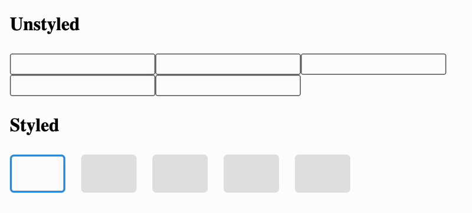

# use-fancy-input

React hook for building fancy input for things like OTP, 2FA Code, etc.

## Demo



#### Source code behind the GIF above

```tsx
const MyComponent = () => {
    const { containerRef, inputs } = useFancyInput({ length: 5 });

    return (
        <>
            <h3>Unstyled</h3>
            <div ref={containerRef}>
                {inputs.map((input) => {
                    return <input {...input.getInputProps()} />;
                })}
            </div>

            <h3>Styled</h3>
            <StyledContainer ref={containerRef}>
                {inputs.map((input) => {
                    return <StyledInput {...input.getInputProps()} />;
                })}
            </StyledContainer>
        </>
    );
};
```
